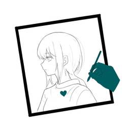

<p align="center">
  
</p>

<h1 align="center">Live2D Master Agent</h1>

<p align="center">
  <strong>用一句话，让 AI 帮你生成一个能动的二次元角色。</strong><br>
  从文本描述 → AI 立绘 → 自动分层 → Live2D 模型 → 可导出可预览。
</p>

<p align="center">
  <a href="https://github.com/mw2wbyys6t-sudo/live2d-auto-pipeline/releases"></a>
  <a href="LICENSE"></a>
  <a href="https://www.python.org/"></a>
  <a href="https://go.dev/"></a>
  <a href="https://nextjs.org/"></a>
</p>

---

## 先说清楚：现在能干什么

我不想给你画饼。这个项目有些部分已经很稳，有些还在路上。下面是**截至 v0.10.3 的真实状态**：

| 能力 | 状态 | 说明 |
|------|------|------|
| AI 生成角色立绘 | ✅ 可用 | Pollinations 免费云端，开箱即用无需 Key；也支持火山引擎/商汤付费高质量生成 |
| 完全离线生图 | ✅ 可用 | 断网时自动降级为占位立绘，保证流程不中断 |
| 自动分层（K-means） | ✅ 可用 | 颜色聚类分层，纯 Python 实现，无需额外模型 |
| 自动分层（SAM 语义） | ⚠️ 需配置 | 语义分割精度更高，但需下载约 2GB 模型权重 |
| PSD 导出 | ✅ 可用 | 需 `pip install psd-tools`；缺了也能降级导出 PNG 包 |
| Live2D moc3 导出 | ✅ 可用 | **自研编译器，已通过 Live2D 官方 Cubism Core 逐像素验收** |
| 面部捕捉驱动 | ⚠️ 需配置 | MediaPipe 实现，需要摄像头 + 安装额外依赖 |
| 桌宠运行 | ⚠️ 需配置 | 需要 pygame，跨平台窗口行为各有差异 |
| LLM 对话 + 语音 | ⚠️ 需 Key | 对话需要 OpenAI/Anthropic API Key 或本地 Ollama |

> 一句话总结：**「生成 → 分层 → 导出」核心链路完全可用，高级交互功能需要额外配置。**

---

## 这个项目解决了什么问题

我自己是个技术爱好者，不是专业画师也不是建模师。我想做一个属于自己的虚拟形象，但发现：

- 找画师画一张立绘：**几百到几千块**
- 找人做 Live2D 绑定：**几千到上万块**
- 自己学：**PS 分层、Live2D Cubism、参数调试，每一样都要好几个月**

所以我写了这个项目——**把「一句话到可用的 Live2D 模型」这条路上最耗时的环节自动化**。你不需要会画画，不需要懂建模，只要描述你想要什么样的角色，剩下的交给代码。

它不能替代专业画师和建模师的精细作品，但能让你**零成本快速获得一个能用的起点**，然后在这个基础上继续打磨。

---

## 这个项目面向谁

### 适合你，如果你……

- **想做自己的虚拟形象，但不会画画** —— 有想法、描述得出想要的角色就行，不需要绘画或建模基础
- **是技术爱好者或程序员** —— 想要一条能自己改、自己扩的角色生成管线，而不是一个黑盒服务
- **在做独立作品** —— 独立游戏原型、同人企划、短片，需要几个风格一致的立绘打底
- **想搞懂 Live2D 模型是怎么组装的** —— 自研 moc3 编译器是完整可读的实现，可以当参考
- **预算为零** —— 免费链路（Pollinations 生图 + K-means 分层 + 自研 moc3 导出）不花一分钱

### 可能不适合你，如果你……

- **要商业级、能直接上镜直播的成品模型** —— 自动绑定给不了那个精度，仍需专业 Live2D 技术师手动精修
- **想照着已有角色或某张立绘复刻** —— 这个项目是从文字描述生成**新**角色，不是照图转模型
- **完全不想碰命令行和环境配置** —— 目前仍要装 Python / Node，没有一键安装包

### 典型使用场景

| 场景 | 怎么用 | 能拿到什么 |
|------|--------|-----------|
| 造一个属于自己的虚拟形象 | 一句话描述 → 生成 → 分层 → 导出 | 可导入 Live2D Cubism / VTube Studio 的 moc3 模型包 |
| 给原型快速凑角色素材 | 换个描述多跑几次，挑满意的 | 立绘 PNG + PSD 分层文件 |
| 直播或录屏配个会动的形象 ⚠️ | 面部捕捉驱动 + 桌宠模式 | 跟着你表情动的桌面角色 |
| 学 Cubism4 模型结构 | 读 `live2d_builder/` 源码 + 跑一遍导出 | 一份能跑通的参考实现 |
| 当可继续打磨的起点 | 导出 PSD 手动改分层，再进 Cubism 精修 | 更接近成品的手工模型 |
| 离线或受限网络环境演示 | 断网自动降级占位立绘 | 流程不中断的演示效果 |

> 标 ⚠️ 的场景需要额外配置：面捕要装 MediaPipe 并接摄像头，桌宠要装 pygame，且跨平台表现有差异。
>
> 如果你落在「可能不适合」那一栏，欢迎先提个 Issue 说清需求——项目还在快速迭代，有些边界是能推的。

---

## 快速开始

### 最快的方式（30 秒体验核心能力）

```bash
# 安装依赖
pip install -r requirements.txt

# 一句话生成角色（用免费的 Pollinations，不需要任何 API Key）
python -m core.cli generate "蓝发猫耳少女，白色背景，日系赛璐璐风格"

# 交互式菜单
python -m core.cli
```

就这么简单。如果你的网络能访问 pollinations.ai，几十秒内你就能在 `output/` 目录看到生成的角色立绘。

### 完整启动（Web 工作台）

需要两个终端：

```bash
# 终端 1 — 启动 Python 后端（端口 8080）
python api_server.py

# 终端 2 — 启动前端
cd web && npm install && npm run dev
```

然后打开 **http://localhost:3000**，你会看到一个 8 页面的工作台。

### Windows 双击运行

```bash
# 首次：双击 install.bat 安装
# 之后：双击 start.bat 启动
```

### Docker

```bash
cp .env.example .env   # 可选，不配 Key 也能用免费功能
docker compose up -d --build
# Web: http://localhost:3000  API: http://localhost:8080
```

> ⚠️ 国内拉 Docker Hub 镜像可能超时，需要在 Docker Desktop 设置代理或切换网络。

---

## 核心流程

```
你的描述          AI 生图           自动分层          导出
  │                │                │               │
  ▼                ▼                ▼               ▼
"蓝发猫耳少女" → 立绘 PNG → 18 层 PSD → .moc3 模型包
                                    ↓
                              可导入 Live2D Cubism
                              可导入 VTube Studio
```

### AI 图像生成

接入多个服务商，按优先级自动降级：

| 优先级 | 服务 | 需要付费？ | 质量 |
|--------|------|-----------|------|
| 1 | Seedream（火山引擎） | 需 Key | 高 |
| 2 | SenseNova（商汤） | 需 Key | 高 |
| 3 | OpenAI 兼容端点 | 需 Key | 取决于模型 |
| 4 | **Pollinations.ai** | **免费** | 中 |
| 5 | 本地占位图 | 免费 | 兜底用 |

不配任何 Key，默认走 Pollinations，完全够用。

### 自动分层

两种模式：

- **K-means 颜色聚类**（默认，纯 Python）：按颜色相近度自动拆分图层，快且不需要额外依赖。
- **SAM + ISNet 语义分割**（需下载模型）：按语义识别头发、五官、衣物等部位，精度更高但需要约 2GB 模型权重。运行 `python scripts/download_models.py` 下载。

标准 18 层顺序：头皮 → 后发 → 中发 → 前发 → 眉毛 → 眼睛 → 口鼻 → 脸 → 颈 → 上衣 → 内衣 → 手臂 → 手 → 裙摆 → 腿 → 配饰 → 兽耳/尾 → 特效。

### Live2D moc3 导出

这是项目里我花了最多心血的部分。

不是调用外部工具，而是**自己写了 moc3 编译器**——从分层 PNG 直接编译出符合 Live2D Cubism4 规范的 `.moc3` 文件，包含网格、骨骼、变形器、28 个表情参数、物理模拟。

> ✅ 已在 **Live2D 官方 Cubism Native Core** 上通过逐像素验收：导出的模型能被官方内核正确加载，参数确实驱动画面。测试覆盖率 392 passed / 3 skipped。

---

## 项目结构

```
├── core/                  Python 核心内核
│   ├── image_gen/           图像生成（多服务商路由 + 离线兜底）
│   ├── segment_engine/      分层引擎（K-means / SAM / ISNet）
│   ├── psd/                 PSD 读写
│   ├── qa/                  质量检测
│   └── workflow.py          全流程编排
├── live2d_builder/        Live2C Cubism4 构建管线
│   ├── mesh/                网格生成
│   ├── bones/               骨骼 + 变形器
│   ├── blendshapes/         28 表情参数
│   ├── physics/             物理模拟
│   └── exporter/            自研 moc3 编译器 ← 核心技术
├── drivers/               实时驱动层
│   ├── face_tracker/        MediaPipe 面部捕捉
│   ├── desktop_pet/         桌宠
│   └── live2d_runtime/      软件 Live2D 渲染
├── llm_bridge/            AI 对话网关
├── api/                   Go REST API（Gin）
├── web/                   Next.js 工作台（8 页面）
├── assets/icon/           项目图标
└── docs/                  文档
```

---

## 配置（可选）

默认零配置即可使用核心功能。如果你想要更高质量的生图或对话能力：

```bash
cp .env.example .env
```

编辑 `.env`，按需填入：

```env
# 高质量生图（可选，不填就用免费的 Pollinations）
ARK_API_KEY=你的火山引擎Key
SENSENOVA_API_KEY=你的商汤Key

# LLM 对话（可选，不填则聊天功能不可用）
OPENAI_API_KEY=sk-你的Key
OPENAI_BASE_URL=https://api.openai.com/v1
LLM_MODEL=gpt-4o-mini

# 或者用本地 Ollama（完全免费）
# 启动 ollama serve && ollama pull qwen2.5:3b 即可，无需填 Key
```

> `.env` 文件已被 `.gitignore` 排除，不会上传到 GitHub。

---

## 已知局限

与其让你踩坑后失望，不如提前说清楚：

1. **生成的角色质量取决于 AI 生图服务商**。免费的 Pollinations 出图质量中等；想要高质量赛璐璐立绘，建议配置火山引擎 Seedream。
2. **SAM 语义分层需要约 2GB 模型权重**。不想下载的话，默认的 K-means 分层也够用。
3. **面部捕捉和桌宠功能依赖摄像头和平台特定库**，在不同操作系统上表现可能不一致。
4. **moc3 导出的模型是「可用但粗糙」的起点**。自动绑定无法替代专业 Live2D 技术师的手动精调——它能让你快速有一个能动的模型，但要追求商业级品质仍需人工打磨。
5. **项目仍在快速迭代中**，API 接口可能随版本变化。

详细说明见 [docs/LIMITATIONS.md](docs/LIMITATIONS.md)。

---

## 测试

```bash
# Python 测试（392 个）
python -m pytest tests/ -v

# Go 测试
cd api && go test ./... -v

# 前端构建检查
cd web && npm run build
```

---

## 版本记录

| 版本 | 日期 | 重点 |
|------|------|------|
| **v0.10.3** | 2026-10-08 | 沙箱就绪：离线兜底生图 + PSD 缺依赖不崩 + 健康检查真实化 + 端口冲突友好提示 |
| v0.10.2 | 2026-09-29 | 离线兜底生成器 + PSD 图层命名 + 桌面打包工具链 |
| v0.10.1 | 2026-09-22 | 自研 moc3 编译器：官方 Cubism 参数驱动 + 逐像素验收通过 |
| v0.10.0 | 2026-09-22 | SAM 语义分层 + 完整 Cubism4 模型包 + MediaPipe 面捕 + LLM 对话 |

完整记录见 [CHANGELOG.md](CHANGELOG.md)。

---

## 文档

| 文档 | 内容 |
|------|------|
| [快速入门](docs/QUICKSTART.md) | 5 分钟跑通 |
| [用户指南](docs/USER_GUIDE.md) | 完整功能说明 |
| [常见问题](docs/FAQ.md) | 遇到问题先看这里 |
| [已知局限](docs/LIMITATIONS.md) | 功能边界 |
| [架构设计](docs/ARCHITECTURE.md) | 技术架构详解 |
| [架构决策](docs/architecture/index.md) | 6 条核心 ADR + 架构不变量 |
| [部署指南](docs/DEPLOY.md) | 云端/本地部署 |

---

## 关于这个项目

这个项目由一个人从零开始摸索着做出来。我不是科班出身，很多技术是边做边学的——所以代码里可能有不够优雅的地方，架构上也有可以改进的空间。

但它解决了一个真实的问题：**让没有绘画和建模基础的人，也能拥有自己的虚拟形象。**

如果你也在做类似的事情，或者对这个方向感兴趣，欢迎交流。

---

## 如何贡献

欢迎所有形式的贡献：

- **提交 Issue** — 反馈 Bug、提功能建议
- **Pull Request** — 修 Bug、加功能、改文档
- **分享作品** — 用这个项目生成的角色（保留署名即可）
- **写教程** — 帮更多小白上手

提交 PR 前请确保 `pytest tests/` 和 `npm run build` 通过。详见 [docs/CODE_STANDARD.md](docs/CODE_STANDARD.md)。

---

## 致谢

这个项目站在巨人的肩膀上：

- [MediaPipe](https://mediapipe.dev/) — 面部捕捉
- [Segment Anything](https://github.com/facebookresearch/segment-anything) — 语义分割
- [pixi-live2d-display](https://github.com/nicxfer/pixi-live2d-display) — Web Live2D 渲染
- [Pollinations.ai](https://pollinations.ai) — 免费 AI 生图
- [Live2D Cubism](https://www.live2d.com/) — 官方规范参考

感谢每一位 Star、Issue、PR 的贡献者。

---

## 许可证

[Apache-2.0](LICENSE) — 商业用途也欢迎。

---

<p align="center">
  
  <br>
  <sub>Made with curiosity and caffeine.</sub>
</p>
